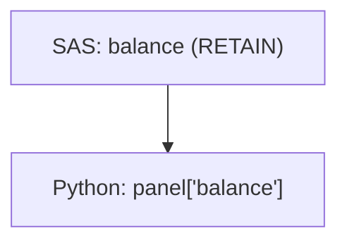

# Code Review Report: {{module_name}}

**Verdict:** {{APPROVED | NEEDS REVISION}}

## 1. Violations
| Rule | Line | Issue | Suggested Fix |
|---|---|---|---|
| 3 | 42 | Beta hardcoded as 0.0312 | Load from `betas.yaml` |

## 2. Module Composition Chain
```mermaid
flowchart LR
    A[loan_dict] --> B[{{module_name}}]
    B --> C[Next Module]
```

## 3. Variable Lineage

